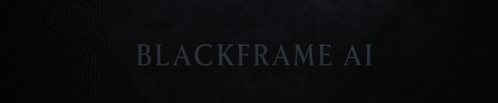

# Blackframe AI
### AI-Powered Game Engines & Original Games

---

### Current Projects

- 🏴 *Purge of the Crescent Veil* — commercial flagship game
- 🛠️ Custom C++ engine — future open source release
- 🤖 AI-driven development pipelines & procedural tooling

---

### About Blackframe AI

Blackframe AI is an independent studio building next-generation AI-powered game engines and original titles.  
Our focus is on integrating cutting-edge AI into core game systems, engine architecture, and procedural design.  
Current flagship project: *Purge of the Crescent Veil*.

---

### Tech Stack

- 🖥️ C++ / Custom Engine Architecture
- 🎮 Unity 6.1 / C# Integration
- 🧠 AI-driven content pipelines
- ⚙️ Procedural generation frameworks

---

### Links

- 🚀 [GitHub Profile](https://github.com/ParentalAdvisery)
- 🎥 *(Coming Soon)* Blackframe AI Devlog YouTube
- 🌐 Official Website: [https://blackframeai.org](https://blackframeai.org)
- 🛠️ *(Coming Soon)* Blackframe Engine Public Repo

---

© 2025 Blackframe AI. All rights reserved.
